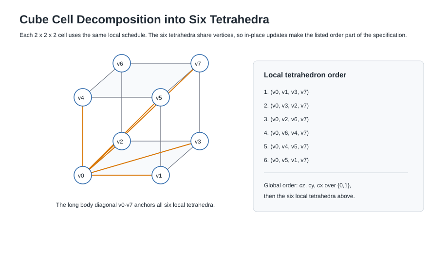

# TriCube Specification

This document is the normative description of the current public TriCube
baseline construction. A conforming implementation must produce the test
vectors in Section 12 and follow the state layout, round transformation,
absorb/finalize/squeeze rules, domain tags, and byte ordering specified here.
The C implementation in `c/src/tricube.c` is the current reference
implementation, but the intended direction is specification first:
implementations should be checked against this document and the fixed vectors,
not treated as the only source of meaning.

This document is not a security proof and it is not a standard.

Established primitive families such as Ascon specify exact state size, round
transformations, constants, modes, rates, and padding before presenting security
claims or implementation results. TriCube follows that documentation style for
clarity. TriCube is not standardized and has not received comparable public
cryptanalytic review.

## 1. Status and Scope

TriCube is an experimental hash, extendable-output function, and deterministic
research stream generator. This specification covers the current public
baseline construction unless a variant is explicitly named. The words "must,"
"shall," and "required" identify behavior that is part of the specified
construction. Implementation notes are labeled separately.

This document does not specify a production cryptographic standard. It does not
establish collision resistance, preimage resistance, pseudorandomness, or
security for real deployments. TriCube must not be used for passwords,
signatures, message authentication, key derivation, encryption, consensus, or
any other security-critical purpose.

The optimized `fast8x` stream path is specified only as an experimental stream
variant. Rejected ablation-lab variants such as `fast8x512`, `fast4x`, and
other high-throughput candidates are not public baseline schemes in this
repository.

## 1.1 Diagrams

The figures below are explanatory, not a replacement for the tables and
pseudocode. If a diagram and the text disagree, the text is normative.

- [State layout](figures/state-layout.svg)
- [Tetrahedral decomposition](figures/tetrahedral-decomposition.svg)
- [Round flow](figures/round-flow.svg)

## 2. Parameters

| Parameter | Baseline value |
|---|---:|
| State size | 2048 bits |
| Word size | 64 bits |
| Number of state lanes | 32 |
| Vertex-grid lanes | 27, lanes `S[0]` through `S[26]` |
| Shell/global lanes | 5, lanes `S[27]` through `S[31]` |
| Vertex grid | `3 x 3 x 3` vertices |
| Cube cells | `2 x 2 x 2`, total 8 cube cells |
| Tetrahedra per cube cell | 6 |
| Tetrahedral neighborhoods per round | 48 |
| Edge neighborhoods per round | 54 grid-adjacent edges |
| Schedule period | 24 rounds for precomputed schedules |
| Message absorb block | 64 bytes |
| Baseline squeeze rate | 192 bytes |
| Digest output | 256 bits, 32 bytes |
| XOF output | arbitrary byte length |
| Stream output | deterministic research stream |
| Baseline hash/XOF rounds | 16 finalization rounds |
| Hash/XOF per-message-block rounds | `half_rounds(16) = 8` |
| Empty-message block | 9-byte block beginning with `0x80` |
| Finalization trailer | 33 bytes |
| Word byte order | little-endian |
| Message length encoding | low 64-bit little-endian byte length plus a zero high word |
| Output-length encoding | 64-bit little-endian encoded output length in trailer |
| Hash domain tag | `TC-TETRA256-V2` |
| Stream baseline domain tag | `TC-TETRA256-V2/STREAM` |
| State-initialization prefix | `TriCube-Tetra256-v2-native` |
| Stream seed encoding | 64-bit little-endian seed in a 16-byte tweak, high 8 bytes zero |

The `V2` text in domain tags and initialization strings is a legacy
compatibility tag from development. It is part of the current vector-compatible
implementation. The public project name is TriCube.

All 64-bit additions are modulo `2^64`. `rotl64(x, r)` is a left rotation of a
64-bit word by `r mod 64`.

Round constants and the initial vector are generated at initialization with a
SplitMix64 stream:

- `ROUND_CONSTANTS[0..767] = SplitMix64(seed = 0x5452494355424556)`;
- `IV[0..31] = SplitMix64(seed = 0x5445545241435542)`.

The SplitMix64 step is:

```text
x = x + 0x9E3779B97F4A7C15
z = x
z = (z xor (z >> 30)) * 0xBF58476D1CE4E5B9
z = (z xor (z >> 27)) * 0x94D049BB133111EB
return z xor (z >> 31)
```

## 3. State Layout


The state is an array of 32 unsigned 64-bit words:

```text
S[0], S[1], ..., S[31]
```

Lanes `0..26` are vertex lanes in a `3 x 3 x 3` grid. Coordinates use
`x, y, z in {0,1,2}` and map to lanes by:

```text
index(x, y, z) = x + 3 * (y + 3 * z)
```

| Lane | Coordinate |
|---:|---|
| 0 | `(0,0,0)` |
| 1 | `(1,0,0)` |
| 2 | `(2,0,0)` |
| 3 | `(0,1,0)` |
| 4 | `(1,1,0)` |
| 5 | `(2,1,0)` |
| 6 | `(0,2,0)` |
| 7 | `(1,2,0)` |
| 8 | `(2,2,0)` |
| 9 | `(0,0,1)` |
| 10 | `(1,0,1)` |
| 11 | `(2,0,1)` |
| 12 | `(0,1,1)` |
| 13 | `(1,1,1)` |
| 14 | `(2,1,1)` |
| 15 | `(0,2,1)` |
| 16 | `(1,2,1)` |
| 17 | `(2,2,1)` |
| 18 | `(0,0,2)` |
| 19 | `(1,0,2)` |
| 20 | `(2,0,2)` |
| 21 | `(0,1,2)` |
| 22 | `(1,1,2)` |
| 23 | `(2,1,2)` |
| 24 | `(0,2,2)` |
| 25 | `(1,2,2)` |
| 26 | `(2,2,2)` |

Lanes `S[27]..S[31]` are shell/global lanes. They do not correspond to grid
vertices. They participate in absorption and round mixing through the shell
coupling layer.

## 4. Tetrahedral Decomposition



The vertex grid contains eight unit cube cells. A cube at cell coordinate
`(cx, cy, cz)` has local vertices:

```text
v0 = index(cx,   cy,   cz)
v1 = index(cx+1, cy,   cz)
v2 = index(cx,   cy+1, cz)
v3 = index(cx+1, cy+1, cz)
v4 = index(cx,   cy,   cz+1)
v5 = index(cx+1, cy,   cz+1)
v6 = index(cx,   cy+1, cz+1)
v7 = index(cx+1, cy+1, cz+1)
```

Each cube is decomposed into these six local tetrahedra:

```text
(v0, v1, v3, v7)
(v0, v3, v2, v7)
(v0, v2, v6, v7)
(v0, v6, v4, v7)
(v0, v4, v5, v7)
(v0, v5, v1, v7)
```

The tetrahedra overlap through shared vertices. The implementation processes
all 48 tetrahedra in a deterministic order and updates the state in place, so
shared vertices carry order-dependent effects within a round.

The global tetrahedron order is generated by iterating `cz`, then `cy`, then
`cx`, each over `{0,1}`, and then iterating the six local tetrahedra above.

## 5. Round Function


The round function is an in-place transformation on all 32 lanes. For
`round r = 0 .. R-1`, with `sr = r mod 24`, the implementation applies:

```text
for each tetrahedron t in 0..47:
    tetrahedral_mix(S, sr, r, t)

for each grid edge e in 0..53:
    edge_couple(S, sr, e)

for each shell coupling j in 0..4:
    shell_couple(S, sr, j)

for i in 0..31:
    T[i] = S[(9*i + 5) mod 32]
S = T

for i in 0..31:
    S[i] = S[i] xor rotl64(RC[(32*sr + i) mod 768] + i + r,
                           ((5*i + sr) mod 61) + 1)
```

The current implementation precomputes the 24-round schedule from these rules
for speed. The schedule is an implementation optimization and must not change
the resulting transformation.

## 6. Tetrahedral Mixing Layer

For tetrahedron index `t`, the base lanes `(a,b,c,d)` are taken from the
tetrahedron table. Orientation changes by round and tetrahedron index:

```text
if ((r + t) & 1): swap b and d
if ((r + t) & 2): swap a and c
```

The rotation set is selected by `(r + t) mod 4`:

| Selector | Rotations `(r0,r1,r2,r3)` |
|---:|---|
| 0 | `(17, 29, 41, 53)` |
| 1 | `(23, 31, 47, 59)` |
| 2 | `(19, 37, 43, 61)` |
| 3 | `(13, 27, 39, 55)` |

Round constants are:

```text
base = (32*r + t) mod 768
rc0 = RC[base]
rc1 = RC[(base + 7) mod 768]
rc2 = RC[(base + 13) mod 768]
rc3 = RC[(base + 21) mod 768]
```

The in-place tetrahedral ARX update is:

```text
x0 = S[a]; x1 = S[b]; x2 = S[c]; x3 = S[d]

x0 = x0 + x1 + rc0
x3 = rotl64(x3 xor x0, r0)
x2 = x2 + x3 + rc1
x1 = rotl64(x1 xor x2, r1)
x0 = x0 + x1 + (rc2 xor t)
x3 = rotl64(x3 xor x0, r2)
x2 = x2 + x3 + (rc3 + r)
x1 = rotl64(x1 xor x2, r3)

S[a] = x0; S[b] = x1; S[c] = x2; S[d] = x3
```

Because tetrahedra share vertices and updates are in place, tetrahedron order is
part of the specification.

## 7. Edge-Coupling Layer

Edges are all axis-adjacent pairs in the `3 x 3 x 3` vertex grid. They are
enumerated by iterating `z`, then `y`, then `x`, and for each vertex adding the
positive `x`, positive `y`, and positive `z` neighbor when present. This yields
54 edges.

For edge index `e` with lanes `(a,b)`, define:

```text
rc = RC[(37*r + 5*e) mod 768]
rot0 = ((e + 3*r) mod 61) + 1
rot1 = ((7*e + r) mod 61) + 1
left = S[a]
right = S[b]
S[a] = left + rotl64(right xor rc, rot0)
S[b] = right xor rotl64(S[a] + rc + e, rot1)
```

The layer updates in place, so edge order matters.

## 8. Shell/Global Lanes

The shell lanes are:

```text
shell_lanes = [27, 28, 29, 30, 31]
```

For shell index `j = 0..4`:

```text
lane = shell_lanes[j]
vertex = (5*r + 7*j) mod 27
opposite = (11*vertex + 3) mod 27
rc = RC[(11*r + 17*j) mod 768]
rot = ((r + 9*j) mod 61) + 1

S[lane] = S[lane] + S[vertex] + rc
S[opposite] = S[opposite] xor rotl64(S[lane] xor S[vertex], rot)
```

The shell lanes are state words used for global coupling and metadata mixing.
They are not treated as entropy sources.

## 9. Lane Permutation

After tetrahedral, edge, and shell coupling, the implementation applies:

```text
T[i] = S[(9*i + 5) mod 32] for i in 0..31
S = T
```

Then each lane receives a round-dependent constant injection:

```text
S[i] = S[i] xor rotl64(RC[(32*r + i) mod 768] + i + r,
                         ((5*i + r) mod 61) + 1)
```

The precomputed schedule stores this as `src`, `rc`, and `rot` per round and
lane.

## 10. Absorb, Finalize, and Squeeze

### Initialization

Initialization starts with `S = IV`. The initialization header is:

```text
"TriCube-Tetra256-v2-native"
uint16_le(domain_len)
uint16_le(tweak_len)
uint32_le(encoded_outlen)
domain bytes
tweak bytes
```

The header is split into 64-byte blocks. Each block is absorbed with
`absorb_bytes`, then `permute64(S, 4)` is applied.

The absorption of eight 64-bit words `W[j]` at block index `b` is:

```text
lane  = (7*j + 5*b) mod 32
mate  = (lane + 11 + j) mod 32
shell = shell_lanes[(j + b) mod 5]

S[lane]  = S[lane] xor (W[j] + 0xD6E8FEB86659FD93 + b + j)
S[mate]  = S[mate] + rotl64(W[j] xor S[lane], ((11*j + b) mod 63) + 1)
S[shell] = S[shell] xor rotl64(S[lane] + S[mate] + W[j],
                               ((13*j + 7) mod 63) + 1)
```

`absorb_bytes` reads each `W[j]` as a little-endian 64-bit word padded with
zero bytes when the input block is shorter than 64 bytes.

### Hash Mode

Hash mode uses domain tag `TC-TETRA256-V2`, encoded output length `32`, and 16
finalization rounds.

For each nonempty message block:

```text
absorb_bytes(S, block, block_index)
permute64(S, 8)
```

For the empty message, a 9-byte block beginning with `0x80` is absorbed and
then `permute64(S, 8)` is applied.

Finalization absorbs a 33-byte trailer:

```text
bytes 0..15   = uint128_le(message_length_bytes), high 64 bits currently zero
bytes 16..23  = uint64_le(encoded_outlen)
bytes 24..31  = uint64_le(number_of_message_blocks)
byte 32       = 0x80
```

After the trailer:

```text
absorb_bytes(S, trailer, block_index + 1)
permute64(S, 16)
squeeze_rate64(S, counter=0, out, 32)
```

### XOF Mode

XOF mode uses the same domain tag and finalization structure as hash mode, but
with encoded output length `0`. Output is produced in chunks of at most 192
bytes by `squeeze_rate64`.

If more output is needed after a squeeze chunk, the state absorbs:

```text
words = [
  counter,
  encoded_outlen,
  message_length_bytes,
  counter xor 0xA5A5A5A5A5A5A5A5
]
```

with block index `message_block_count + counter + 2`, then applies
`permute64(S, 8)`.

### Baseline Stream Mode

Stream mode is a deterministic research stream, not a random bit generator for
security use.

Baseline stream mode uses domain tag `TC-TETRA256-V2/STREAM`, a 16-byte seed
tweak, 12 initialization rounds, 6 rounds per stream step, and 192 output bytes
per state update. The seed tweak is:

```text
uint64_le(seed) || 8 zero bytes
```

Stream initialization:

```text
init_state(S, stream_domain, seed_tweak, outlen=64)
absorb_bytes(S, seed_tweak, block_index=0)
permute64(S, 12)
```

For each stream counter `c`:

```text
words = [
  c,
  c xor 0x9E3779B97F4A7C15,
  seed + c,
  seed * 0xD6E8FEB86659FD93 + c
]
absorb_words(S, words, 4, c + 1)
permute64(S, 6)
squeeze_rate64(S, c, output, up to 192 bytes)
```

The CLI writes stream data in 1 MiB chunks, but chunking does not affect output.

## 11. Baseline vs Experimental Variants

Only the baseline and `fast8x` are implemented in this repository.

| Variant | Purpose | Init rounds | Step rounds | Output rate | Output layer | Status |
|---|---|---:|---:|---:|---|---|
| `baseline` | Preserved public reference stream | 12 | 6 | 192 bytes | `squeeze_rate64` | default |
| `fast8x` | Faster stream/XOF testing path | 8 | 4 | 256 bytes | `squeeze_rate64_xmix` | experimental opt-in |

The `fast8x` variant is domain-separated with tag
`TC-TETRA256-V2/STREAM/FAST8X`. It is available through the C API and CLI, but
it does not replace the baseline. Faster ablation-lab variants are not public
reference schemes in this repository.

## 12. Test Vectors

These vectors are produced by the current C CLI.

| Case | Input | Output |
|---|---|---|
| Hash empty | empty byte string | `7fcaaa35165277bcaca583e23ef1d3545705e14d39f3ed7a802b1275d920cf49` |
| Hash `abc` | `616263` | `779403a9c748fc3213493953fc17309367b37161c00dc19059c14db63774e11e` |
| XOF `abc`, 64 bytes | `616263` | `6118c4b547c28533b968d6b7fc0b171817d8d9b1ced9e8c832dc7903e73baadcb6ce828c5f50d697bffddaef772c0b89d9314970df8cb5f15e95af6143e0667c` |
| Baseline stream seed 123, first 64 bytes | seed `123` | `9ccace5701711cc2b47c06bf5a1a2b2b0bb5df09a8fb47a473ea18e34fef3695b7e233322a0b04a691402be1c630f070d954848a5c4013e8c745968288216d98` |
| Experimental fast8x stream seed 123, first 64 bytes | seed `123`, `--variant fast8x` | `33d4d2da3afff406189a50b42322c03b2f1f9c411444d2b7347561fb9a882b3f4fcd0bbf306434b88a634e51d3f026e1466469adc8b688d4504f65355bb643ee` |

The packaged vector file is `python/src/tricube/data/tricube_vectors.json`.

## 13. Implementation Notes

The standalone C implementation is the public reference implementation in this
repository. The Python package provides a reference implementation and tests
against fixed vectors.

Precomputed schedules in `c/src/tricube.c` are implementation optimizations.
They are derived from the algorithms above and must not change public outputs.

The context API currently buffers message input before finalization. This is an
engineering limitation, not a primitive-level feature.

## 14. Security Considerations

TriCube has no security proof, collision-resistance proof, preimage-resistance
proof, or independent cryptanalytic review.

The current project has not completed formal differential cryptanalysis,
rotational cryptanalysis, algebraic analysis, trail search, SAT/MILP analysis,
Gröbner-basis analysis, reduced-round attacks, side-channel review, or
production implementation review.

Statistical batteries and black-box probes can find problems. Passing them does
not establish cryptographic security.

## 15. Current Development Probes and What They Are Not

The public result summary uses several probe and screen names. These are not
part of the TriCube primitive specification, but they are documented here
because their names can otherwise be misunderstood.

The black-box differential diffusion probe flips selected input differences and
measures output Hamming distance, output-bit bias, and repeated output
differences across selected reduced-round settings. It does not model
differential propagation inside the round function. It does not search
differential trails, compute maximum differential probability, or replace
differential cryptanalysis.

The black-box rotational relation probe applies selected word rotations and
measures rotational distance and exact preserved-relation counts across selected
reduced-round settings. It does not prove resistance to rotational
distinguishers.

The small black-box algebraic degree screen samples selected variables and
output bits and estimates algebraic-normal-form degree under a limited budget.
It does not perform SAT, MILP, Gröbner-basis, full ANF, invariant, or integral
analysis.

The black-box state-recovery/predictability screen measures simple predictor
behavior against random baselines. It does not model or recover the internal
2048-bit state.

The overlap/fork stream uniqueness screen checks for repeated blocks across
related streams. It does not prove stream independence.

The collision and birthday screens compare small practical sample counts
against birthday expectations. They do not establish collision resistance.

The detailed current probe descriptions are maintained in
`docs/testing.md`. Passing any of these probes means that no obvious failure was
found under the tested budget. It is not a security validation.

## References

- NIST SP 800-232, *Ascon-Based Lightweight Cryptography Standards for
  Constrained Devices: Authenticated Encryption, Hash, and Extendable Output
  Functions*.
- Dobraunig, Eichlseder, Mendel, and Schläffer, "Ascon v1.2: Lightweight
  Authenticated Encryption and Hashing," *Journal of Cryptology*, 2021.
