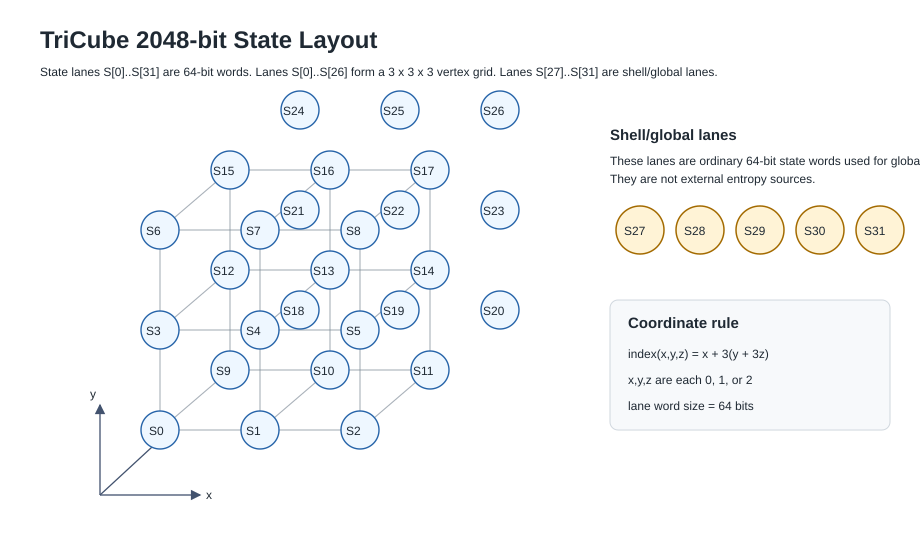
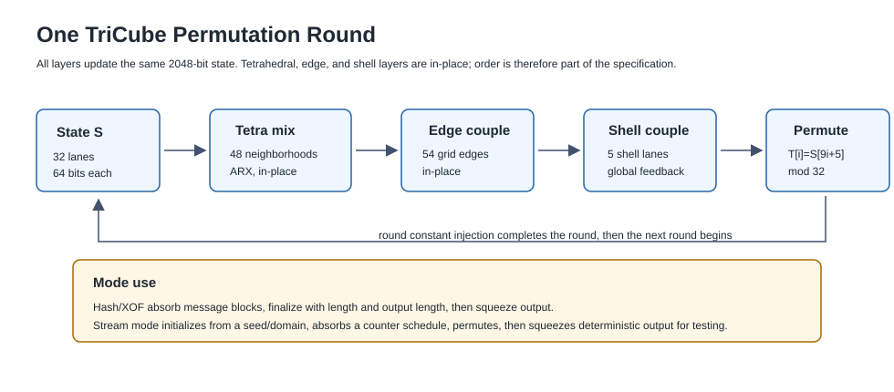

# TriCube: Experimental Evaluation of a Tetrahedral/Cube-Connected Hash and XOF Primitive

Preliminary Technical Manuscript — Public Review Draft

Steven Reid

Independent Researcher  |  sreid1118@gmail.com

May 20, 2026  |  Apple M4 Pro / macOS 15.5  •  Python 3.13/3.14  •  Apple clang 17.0.0

SCOPE NOTICE: This is a preliminary public-review manuscript. Evidence consists of unit tests, internal benchmarks, black-box development probes, a first word-level white-box schedule model, and external statistical-battery results from local research runs. No wording constitutes a claim of cryptographic security. PractRand low-bit warnings remain unresolved and formal cryptanalysis remains future work.

## Abstract

We report the design and experimental evaluation of TriCube, a candidate hash function and extendable-output function (XOF) based on tetrahedral/cube-connected state evolution. The current public baseline uses a 2048-bit state with thirty-two 64-bit lanes. Twenty-seven lanes form a 3 × 3 × 3 vertex grid; five shell/global lanes provide additional global coupling. The eight cube cells of the grid are decomposed into six tetrahedra each, giving 48 tetrahedral neighborhoods per full pass. Each round combines local tetrahedral ARX mixing, grid-edge coupling, shell/global coupling, and a deterministic lane permutation.

Evaluation covers unit tests and vector agreement, internal statistical benchmarks, black-box development probes, and external statistical batteries. The public baseline and the experimental fast8x stream variant are separated by domain tags and by API/CLI selection. The evidence supports continued review and engineering work; it does not establish collision resistance, preimage resistance, pseudorandomness, or security for deployment.

Keywords: hash function, XOF, geometric primitive, tetrahedral decomposition, cube-connected state, sponge construction, PractRand, TestU01, black-box development probes

## 1. Introduction

The design of cryptographic hash functions is a mature but active area. SHA-2 [1], SHA-3 (Keccak) [2], BLAKE2 [3], and BLAKE3 [4] have undergone extensive public cryptanalysis and are widely deployed. The dominant paradigm for efficient software hash designs is ARX: Add-Rotate-XOR, which combines modular addition, bitwise rotation, and exclusive-or to achieve diffusion and non-linearity within a fixed state.

TriCube explores an alternative: geometric state evolution. The current public baseline maps a 2048-bit state onto a 3 × 3 × 3 cube-vertex grid plus five shell/global lanes. State advancement uses local tetrahedral mixing over 48 tetrahedral neighborhoods, edge-coupling passes over 54 grid-adjacent vertex pairs, shell/global coupling, and a deterministic lane permutation. This structure is intended to make the construction inspectable and testable, not to imply a security claim.

The motivation is exploratory. We do not claim any advantage in security or efficiency over established designs. We document the construction, measure its empirical statistical behavior, and probe it with targeted black-box development screens to characterize what is and is not known. The results are a development snapshot as of May 19, 2026: encouraging as a first filter, but insufficient to support any cryptographic security claim.

## 2. Related Work

The established hash landscape is dominated by ARX and permutation-based designs. SHA-2 [1] uses Merkle-Damgård with an ARX compression function. SHA-3 (Keccak) [2] is a sponge construction over a 1600-bit state organized as a 5×5 matrix of 64-bit lanes, using bitwise permutation steps (θ, ρ, π, χ, ι). BLAKE2/BLAKE3 [3][4] are ARX designs derived from ChaCha with tree-hashing modes for parallelism. All have received extensive public cryptanalysis.

CubeHash [5] is a close name-level comparison because it also uses cube language, although its state layout and round function differ substantially. TriCube also sits near sponge and ARX designs, because it absorbs input, permutes state, and squeezes output using addition, rotation, and XOR. Established families such as Ascon specify exact state size, round transformations, constants, modes, rates, and padding before making scheme-level claims; TriCube follows that documentation style for clarity, but it is not standardized and has not received comparable cryptanalytic review.

## 3. Construction Design

3.1 State Representation

The current public TriCube baseline uses a 2048-bit state represented as thirty-two 64-bit words S[0] through S[31]. Lanes S[0] through S[26] are vertex lanes in a 3 × 3 × 3 grid. Coordinates x, y, z ∈ {0,1,2} map to lane index x + 3(y + 3z). Lanes S[27] through S[31] are shell/global lanes. They are state words used for global coupling and metadata mixing, not external entropy sources.



All words are interpreted little-endian when absorbing or emitting bytes. All 64-bit additions are modulo 2^64. ROTL64(x, r) denotes a left rotation by r mod 64 bits.

3.2 Tetrahedral Decomposition

The 3 × 3 × 3 vertex grid contains eight unit cube cells. For a cube at cell coordinate (cx, cy, cz), the local vertices are v0=(cx,cy,cz), v1=(cx+1,cy,cz), v2=(cx,cy+1,cz), v3=(cx+1,cy+1,cz), v4=(cx,cy,cz+1), v5=(cx+1,cy,cz+1), v6=(cx,cy+1,cz+1), and v7=(cx+1,cy+1,cz+1), mapped through the lane-index formula above.

Each cube cell is decomposed into six tetrahedral neighborhoods: (v0,v1,v3,v7), (v0,v3,v2,v7), (v0,v2,v6,v7), (v0,v6,v4,v7), (v0,v4,v5,v7), and (v0,v5,v1,v7). Across eight cube cells this gives 48 tetrahedral neighborhoods per full pass. The tetrahedra share vertices and are updated in a deterministic order, so the in-place update order is part of the construction.


3.3 Round Function

A TriCube round applies four layers in sequence: tetrahedral local mixing, grid-edge coupling, shell/global coupling, and lane permutation with constant injection. The implementation precomputes a 24-round schedule for speed, but the schedule is derived from the deterministic rules in docs/specification.md and must not change the public output.



```text
for round r in 0..R-1:
    for each tetrahedron t in deterministic order:
        apply orientation-dependent four-lane ARX mix in place
    for each axis-adjacent grid edge e in deterministic order:
        couple the two endpoint lanes in place
    for each shell/global lane j in 0..4:
        mix shell lane S[27+j] with a scheduled vertex and opposite vertex
    permute all 32 lanes by T[i] = S[(9*i + 5) mod 32]
    xor a round-dependent rotated constant into each lane
```

The tetrahedral ARX layer uses rotation sets (17,29,41,53), (23,31,47,59), (19,37,43,61), and (13,27,39,55), selected by round and tetrahedron index. Round constants are generated by a SplitMix64 stream from fixed seeds and are specified normatively by the generator rule rather than by listing all 768 constants in the manuscript.

3.4 Absorb, Finalize, and Squeeze

Hash mode uses the domain tag TC-TETRA256-V2, a 64-byte message absorb block, a 33-byte finalization trailer, and a 16-round final permutation before squeezing a 256-bit digest. The V2 substring is a legacy compatibility tag in the domain string and does not change the public project name, which is TriCube.

The finalization trailer contains the little-endian message length, encoded output length, message-block count, and a final 0x80 marker. XOF mode uses the same construction with encoded output length zero and produces output in chunks of up to 192 bytes. Stream mode uses a separate domain tag and a 64-bit little-endian seed tweak. The default stream path remains the released baseline.

The exact parameter table, lane table, tetrahedron schedule, round pseudocode, absorb/finalize/squeeze rules, endianness, padding, domain separation, and test vectors are maintained in docs/specification.md. That file is the reference specification for independent reimplementation.

## 4. Implementation

The public repository is organized around a standalone C11 implementation and a small Python package. The C implementation in c/src/tricube.c is the reference implementation for the public baseline. The public header c/include/tricube.h exposes fixed 256-bit digest mode, XOF mode, context-style update/finalize/squeeze functions, deterministic stream generation, and self-test support.

The Python package exposes tricube.hash, tricube.hexdigest, tricube.xof, tricube.stream, tricube.self_test, and security_notice. The Python path is intended for scripting, packaging, and vector checks; the C path is the primary implementation path for external battery testing and throughput work.

The experimental fast8x stream entry points are implemented as a named opt-in stream variant. They are domain-separated from the baseline and do not alter hash vectors, XOF vectors, or the default stream behavior. The shared permutation and fast8x profile live in c/src/tricube.c, while the public fast8x entry points are exposed through c/src/tricube_fast8x.c.

The public repo is https://github.com/RRG314/tricube-hash. It intentionally excludes raw private archives, scratch scripts, private filesystem paths, and unpromoted high-speed variants that failed low-bit screens.

## 5. Test Environment

All results were collected in a single session on the following machine. Throughput results are specific to this hardware; statistical results should be consistent within sampling variance across platforms.

| Parameter | Value |
| --- | --- |
| Host | Mac mini local research machine |
| Operating System | macOS 15.5 for public result summary; later local checks on macOS with Python 3.14 |
| Kernel | Darwin / arm64 |
| CPU | Apple M4 Pro (arm64) |
| Memory | 48 GiB |
| Logical / Physical CPUs | 12 / 12 |
| Python | CPython 3.13.2 in original research runs; CPython 3.14.3 in later local checks |
| NumPy | not required by the public package tests |
| pytest | 9.0.3 in local package checks |
| C Compiler | Apple clang 17.0.0 |
| C Standard | -std=c11  -O3  -DNDEBUG |
| Test date | May 19–20, 2026 |

Table 1. Hardware and software environment.

Key reproduction commands:

.venv/bin/python -m pytest -q

python benchmarks/bench_stream.py --bytes 104857600

tools/run_practrand.sh 1073741824

This manuscript keeps the main claim narrow. The body describes the construction and the strongest current evidence. Large command transcripts, raw battery logs, and generated tables belong in the repository artifacts rather than in the main paper.

## 6. Unit Tests and Internal Benchmarks

### 6.1 Unit Tests

The Python test suite verifies byte-level correctness against expected-output test vectors and invariant properties: expected outputs for all implementation variants, byte-by-byte agreement between the Python native path and the C binary, and invariant properties (non-zero output, distinct seeds produce distinct output, correct output length). Result: 15 passed in 4.90 seconds; no failures, errors, or skips.

### 6.2 Internal Statistical Benchmark

The internal benchmark measures throughput, byte entropy (Shannon H(X) over 256 byte values; maximum 8.000 bits/byte), bit balance, serial correlation at lag 1 (Pearson ρ₁), and avalanche mean across all variants. Preserved slow baseline paths were capped at 65,536 bytes; production paths were measured at 1,048,576 bytes.

| Generator | Status | Bytes | MiB/s | Entropy (bits/byte) | Bit Balance | Serial Corr ρ₁ | Avalanche | Rep. Blocks |
| --- | --- | --- | --- | --- | --- | --- | --- | --- |
| tricube_tc256_xof | PASS | 65,536 | 22.37 | 7.996873 | 0.4998 | 0.000985 | 0.4988 | 0 |
| tricube_tc256_xof_fast | PASS | 1,048,576 | 74.90 | 7.999817 | 0.4999 | 0.000759 | 0.5020 | 0 |
| tricube_geo256_chain | PASS | 65,536 | 0.12 | 7.997174 | 0.4997 | 0.001813 | 0.4951 | 0 |
| tricube_geo256_chain_fast | PASS | 1,048,576 | 62.35 | 7.999848 | 0.5000 | 0.000753 | 0.4990 | 0 |
| tricube_tetra_block256_chain | PASS | 1,048,576 | 10.67 | 7.999802 | 0.4998 | -0.000870 | 0.5038 | 0 |
| tricube_tetra_block256_chain_fast | PASS | 1,048,576 | 57.67 | 7.999822 | 0.5001 | 0.000616 | 0.5038 | 0 |
| tricube_tetra_block256_native | PASS | 65,536 | 0.059 | 7.996933 | 0.4993 | -0.004718 | 0.5042 | 0 |
| legacy native TriCube prototype | PASS | 1,048,576 | 0.23 | 7.999798 | 0.4999 | -0.001290 | 0.5012 | 0 |
| standalone C TriCube stream | PASS | 1,048,576 | 44.30 | 7.999798 | 0.4999 | -0.001290 | 0.5012 | 0 |
| sha256_counter_chain (ctrl) | PASS | 1,048,576 | 48.11 | 7.999830 | 0.5001 | 0.000219 | 0.5035 | 0 |
| tricube_fast8x_stream_c | PASS | 16,777,216 | 132.65 | 7.999991 | 0.499993 | 0.000102 | 0.4996 | 0 |

Table 2. Internal statistical benchmark. All TriCube variants passed all sanity gates. Entropy: 7.997–8.000 bits/byte. Bit balance: within 0.001 of 0.5. Serial correlation |ρ₁| < 0.005. Avalanche mean: 0.495–0.504.

### 6.3 Throughput (100 MiB)

A 100 MiB stream benchmark assessed sustained throughput for the original Python recovery candidates. Those measurements are useful implementation evidence but not a competitive hash benchmark. The later C ablation harness measured the released baseline at 69.796 MiB/s and the experimental fast8x stream variant at 132.655 MiB/s on a 256 MiB stream run. Optimized native implementations of BLAKE3, SHA-2, and SHA-3 can operate much faster on modern hardware, so these numbers should be read as prototype engineering results.

| Generator | Throughput | Bytes Measured | Notes |
| --- | --- | --- | --- |
| tricube_geo256 | 0.122 MiB/s | 1,048,576 | Baseline cap (preserved reference path) |
| tricube_geo256_fast | 59.197 MiB/s | 104,857,600 | Full 100 MiB run |
| tricube_tc256_xof | 22.174 MiB/s | 1,048,576 | Baseline cap (preserved reference path) |
| tricube_tc256_xof_fast | 82.219 MiB/s | 104,857,600 | Full 100 MiB run — fastest Python variant |
| tricube_tetra_block256 | 9.692 MiB/s | 104,857,600 | Full 100 MiB run |
| tricube_tetra_block256_fast | 54.889 MiB/s | 104,857,600 | Full 100 MiB run |
| tricube_tetra_block256_native | 0.056 MiB/s | 1,048,576 | Native squeeze cap |
| legacy TriCube prototype | 0.221 MiB/s | 1,048,576 | Native squeeze cap |
| sha256_counter_chain | 48.598 MiB/s | 104,857,600 | Reference control (same Python harness) |
| tricube_c_stream_fast8x | 132.655 MiB/s | 268,435,456 | Experimental opt-in stream variant; cleanest optimized ablation candidate |
| tricube_c_stream_baseline | 69.796 MiB/s | 268,435,456 | Released baseline in the same ablation harness |

Table 3. Throughput summary. The Python-candidate rows come from the original 100 MiB harness; the C baseline and fast8x rows come from the later ablation harness on the Apple M4 Pro local research machine.

6.4 fast8x Stream Variant Update

After the original May 2026 evaluation, a private ablation pass tested faster stream/XOF paths. The only optimized candidate added to this public branch is fast8x. It uses a separate stream domain tag, 8 initialization rounds, 4 per-block stream rounds, a 256-byte stream rate, and an additional TriCube-family output mixing layer. It must be requested explicitly with --variant fast8x.

In the ablation harness, fast8x measured 132.655 MiB/s on a 256 MiB stream run, compared with 69.796 MiB/s for the released baseline in the same harness. A later 64 MiB branch smoke run measured 130.940 MiB/s for fast8x and 73.067 MiB/s for the baseline. The ablation record lists fast8x as clean through PractRand 1 GiB, SmokeRand express 7/7, TestU01 SmallCrush 15/15, and 16 MiB internal sanity probes with no repeated 32-byte blocks.

Faster variants were not promoted. fast8x_batch reached 311.98 MiB/s but failed PractRand low-bit FPF checks; fast8x_wide reached 285.71 MiB/s but showed very suspicious low-bit rows; fast8x512 reached 230.74 MiB/s but had recurring low-bit warnings. The public rule is conservative: speed gains that introduce repeatable low-bit warnings do not get promoted.

## 7. Structural Checks and Black-Box Development Probes

The following probes are black-box development screens using observable input/output behavior. They are development evidence, not cryptographic validation. They do not model differential trails, prove resistance to rotational distinguishers, perform SAT/MILP or Gröbner-basis analysis, or prove state-recovery resistance.

### 7.1 Structural Gap Checks

| Check | Status | Key Quantitative Result | Elapsed (s) |
| --- | --- | --- | --- |
| full_digest_collision_smoke | PASS | 20,000 pairs; 0 full collisions; 0 prefix-64 collisions | 73.98 |
| low_weight_input_test | PASS | 2,561 unique outputs; min/mean/max Hamming = 103/128.3/150 | 9.42 |
| sampled_near_collision_distance | PASS | 4,096 pairs; min/mean/max Δbits = 103/128.2/157 | 33.64 |
| domain_tweak_separation | PASS | 5 tweaks; min pairwise Hamming = 121 | — |
| bit_influence_spread | PASS | mean flip p = 0.5010; range 0.426–0.570 | — |
| overlap_fork_stream_uniqueness | PASS | 4 streams × 262,144 blocks; 0 overlapping 32-byte blocks | 0.26 |

Table 4. Structural gap checks. 20,000 collision pairs, 4,096 near-collision pairs, domain separation, low-weight inputs, and overlap/fork stream uniqueness checks all returned PASS under the tested budget.

### 7.2 Black-Box Differential Diffusion and Rotational Relation Probes

| Status | Cases | Mean Δbits Range | Max Output-bit Bias | Repeated Diffs | Elapsed (s) |
| --- | --- | --- | --- | --- | --- |
| PASS | 36 | 127.704–128.348 | 0.042969 | 0 | 386.5 s |

Table 5. Black-box differential diffusion probe (36 cases, 6 delta patterns × 6 round counts, 2,048 samples each). Mean output difference was 127.7–128.3 bits, max bias was 0.043, and no repeated differences were observed. This is a black-box development screen, not trail-based differential cryptanalysis.

| Status | Cases | Mean Rot. Dist. Range | Exact Rot. Relations | Elapsed (s) |
| --- | --- | --- | --- | --- |
| PASS | 36 | 127.570–128.284 | 0 | 393.8 s |

Table 6. Black-box rotational relation probe (36 cases, 6 rotation amounts × 6 round counts, 2,048 samples each). Mean rotational distance stayed near 128.0, and no exact rotational relations were observed. This is not formal rotational cryptanalysis.

### 7.3 Small Black-Box Algebraic Degree Screen

The small black-box algebraic degree screen estimates sampled Boolean degree over 10 input variables for selected output bits. It is intended to catch obvious low-degree behavior. It does not perform SAT, MILP, Gröbner-basis analysis, full ANF extraction, or invariant cryptanalysis.

| Rounds | Vars | Out Bits | Status | Min Degree | Mean Degree | Max Degree | Low-deg Outputs | Elapsed (s) |
| --- | --- | --- | --- | --- | --- | --- | --- | --- |
| 1 | 10 | 128 | PASS | 9 | 9.578 | 10 | 0 | 1.66 |
| 2 | 10 | 128 | PASS | 9 | 9.531 | 10 | 0 | 1.78 |
| 4 | 10 | 128 | PASS | 9 | 9.516 | 10 | 0 | 2.06 |
| 8 | 10 | 128 | PASS | 9 | 9.531 | 10 | 0 | 2.61 |
| 12 | 10 | 128 | PASS | 9 | 9.523 | 10 | 0 | 3.20 |
| 16 | 10 | 128 | PASS | 9 | 9.359 | 10 | 0 | 4.04 |

Table 7. Small black-box algebraic degree screen at six round counts. Sampled ANF degree was near the 10-variable ceiling at all tested rounds; zero low-degree sampled outputs were detected. This does not replace formal algebraic cryptanalysis.

### 7.4 Overlap/Fork Stream Uniqueness and State-Recovery/Predictability Screens

| Status | Streams | Bytes/Stream | Block Size | Blocks Tested | Overlaps | Mean Pfx Hamming | Elapsed (s) |
| --- | --- | --- | --- | --- | --- | --- | --- |
| PASS | 4 | 4,194,304 | 32 B | 524,288 | 0 | 4,074 bits | 0.49 s |

Table 8. Overlap/fork stream uniqueness screen. No overlapping 32-byte blocks across 4 streams × 524,288 blocks.

| Status | Train Bytes | Test Bytes | Next-byte Acc. | Bit Accuracy | BM LC Ratio | Elapsed (s) |
| --- | --- | --- | --- | --- | --- | --- |
| PASS | 2,097,152 | 2,097,152 | 0.00396 | 0.50009 | 0.5000 | 7.35 s |

Table 9. Black-box state-recovery/predictability screen. Next-byte accuracy (0.00396) is at chance (1/256 ≈ 0.00391). BM linear complexity ratio 0.5000, consistent with a non-linear sequence.

### 7.5 Reduced-Round Combined Probe

A combined reduced-round screen ran the black-box differential diffusion and black-box rotational relation probes across 72 cases and six round counts. All 72 cases returned PASS under the tested budget. This result is useful triage evidence, but it does not bound reduced-round attack complexity.

Figure 4. Black-box development-probe dashboard. (a) Differential diffusion mean Δbits, all near ideal 128.0. (b) Rotational relation distance, all near 128.0, zero exact relations. (c) sampled ANF degree vs. rounds, near variable count 10. (d) black-box state-recovery/predictability screen near chance baselines.

### 7.6 White-Box Round-Model Check

The branch now includes a first white-box schedule model in tests/crypto_analysis/screens/whitebox_round_model.py. Unlike the black-box probes, this script reads the specified tetrahedron, edge, shell, and lane-permutation rules directly. It tracks word-level dependency: which original 64-bit lanes can influence which later 64-bit lanes after each round.

The 24-round local run reports 48 tetrahedral neighborhoods and 54 edge neighborhoods per round. At word granularity, all tracked state lanes reached full 32-lane dependency by round 2, and the first 32 output bytes also reached full 32-lane dependency by round 2. The same report records that shell vertex and opposite-lane schedules touch all 27 vertex lanes over the 24-round schedule period, and that edge and permutation layers use all rotation counts 1 through 61.

This is useful schedule evidence. It is not a differential trail search, rotational analysis, algebraic model, SAT/MILP result, or state-recovery attack. It only says that the current schedule gives broad word-level reachability quickly.

## 8. External Statistical Battery Evaluation

External statistical batteries apply diverse tests to pseudorandom output, checking for deviations from true-random behavior. Passing batteries is necessary but far from sufficient for cryptographic quality — many constructions with exploitable weaknesses pass standard batteries at moderate data volumes [10]. All batteries were run against the C binary via stdin32 streaming adapter.

| Battery | Generator | Status | Bytes Requested | Runtime | Notes |
| --- | --- | --- | --- | --- | --- |
| Dieharder (full) | standalone C TriCube stream | PASS | ~1 TiB consumed | ~75 s | 109 PASSED, 2 WEAK, 0 FAILED — complete run |
| TestU01 Crush | standalone C TriCube stream | PASS | ~multi-GiB | 26m 22s | 144 tests, 0 failed, 0 suspected — all passed |
| PractRand 128 MiB | standalone C TriCube stream | WARN | 134,217,728 | 3.1 s | No stdout anomalies; WARN from SIGPIPE harness |
| PractRand 1 GiB | standalone C TriCube stream | WARN | 1,073,741,824 | 152 s | Low-bit NS3 anomalies at 1 MiB and 512 MiB |
| PractRand 64 MiB | tricube_geo256_fast | PASS | 67,108,864 | 1.8 s | No anomalies; producer exited cleanly |
| PractRand 64 MiB | sha256_counter_chain | WARN | 67,108,864 | 1.9 s | SIGPIPE harness warning; no stdout anomalies |
| PractRand 1 GiB | fast8x | PASS | 1,073,741,824 | ablation-lab | Clean in the optimized-variant screen; continued multi-seed testing still required |
| SmokeRand express | fast8x | PASS | express battery | ablation-lab | 7/7 tests passed |
| TestU01 SmallCrush | fast8x | PASS | 15 tests | ablation-lab | 15/15 tests passed |

Table 10. External battery summary. WARN entries with no stdout anomalies reflect SIGPIPE harness exit, not statistical failures. The PractRand 1 GiB WARN is a real statistical finding.

Figure 5. External battery results. (a) Dieharder: 109 PASSED, 2 WEAK (sts_serial), 0 FAILED. (b) TestU01 Crush: 186 p-values, near-uniform, none anomalous. (c) PractRand 1 GiB checkpoints with NS3 R-statistic overlay: anomalies at 1 MiB and 512 MiB; final 1 GiB checkpoint clean.

### 8.1 Dieharder — Complete Run

A complete Dieharder 3.31.2beta run consuming ~1 TiB produced 109 PASSED, 2 WEAK, 0 FAILED across 111 assessments. The two WEAK results are both sts_serial at ntuple 15 (p=0.99994) and ntuple 16 (p=0.99636). In Dieharder, WEAK means the p-value is in the extreme tail but not extreme enough to be FAILED. With 111 tests at a 0.005 tail threshold, the expected number of WEAK results is ≈1.1, making 2 within normal variation. Mean p-value across all assessments: 0.2299 (stddev 0.1487, error-rate 0.0).

| Test Family | Assessments | PASSED | WEAK | FAILED | Notes |
| --- | --- | --- | --- | --- | --- |
| diehard_*  (classic Diehard suite) | 13 | 13 | 0 | 0 | birthdays, operm5, rank_32x32, rank_6x8, bitstream, opso, oqso, dna, count_1s_str/byt, parking_lot, 2dsphere, 3dsphere |
| diehard_squeeze, diehard_runs (×2), diehard_craps (×2) | 5 | 5 | 0 | 0 | All new vs. prior partial artifact |
| marsaglia_tsang_gcd (×2) | 2 | 2 | 0 | 0 |  |
| sts_monobit, sts_runs, sts_serial (ntup 1–16, 32 rows) | 35 | 33 | 2 | 0 | WEAK: sts_serial ntup=15 (p=0.99994) and ntup=16 (p=0.99636); expected at this sample size |
| rgb_bitdist (ntup 1–12) | 12 | 12 | 0 | 0 |  |
| rgb_minimum_distance (dim 2–5) | 4 | 4 | 0 | 0 |  |
| rgb_permutations (ntup 2–5) | 4 | 4 | 0 | 0 |  |
| rgb_lagged_sum (lag 0–32) | 33 | 33 | 0 | 0 |  |
| rgb_kstest_test | 1 | 1 | 0 | 0 |  |
| dab_bytedistrib, dab_dct | 2 | 2 | 0 | 0 |  |
| dab_filltree2 (ntup 0–1) | 2 | 2 | 0 | 0 | Test 207 skipped by Dieharder binary |
| dab_monobit2 | 1 | 1 | 0 | 0 |  |
| TOTAL | 111 | 109 | 2 | 0 | Mean p-value 0.2299; stddev 0.1487; error-rate 0.0 |

Table 11. Full Dieharder battery breakdown. 109 PASSED, 2 WEAK, 0 FAILED across 111 rows.

### 8.2 TestU01 Crush — Complete Run

Full TestU01 Crush (144 tests) was completed against the C generator. Of 186 individual p-values extracted, none fell below 0.001 or above 0.999 (range: 0.003–0.998). The battery reported "All tests were passed" after 26m 22s CPU time. Crush applies ~14× as many tests as SmallCrush, including bit-level distribution, autocorrelation, and high-dimensional uniformity tests. Passing without failure or suspected result is meaningful evidence of output quality, within the caveat that battery tests cannot certify cryptographic security.

| Metric | Value |
| --- | --- |
| Battery | TestU01 Crush (v1.2.3) |
| Generator | standalone C TriCube stream (stdin32) |
| Host | Mac mini local research machine (Apple M4 Pro public summary) |
| Number of statistics | 144 |
| Total CPU time | 00:26:22.53 |
| Tests FAILED | 0 |
| Tests suspected | 0 |
| p-values extracted | 186  (across multi-statistic tests) |
| p < 0.001 (anomalous) | 0 |
| p > 0.999 (anomalous) | 0 |
| p-value range | 0.003 – 0.998  (all within expected uniform distribution) |
| Summary verdict | All tests were passed |

Table 12. TestU01 Crush summary. 144 tests, 186 p-values, all within expected uniform range. CPU time: 26m 22s.

### 8.3 PractRand Evaluation

IMPORTANT: The PractRand 1 GiB run produced real statistical anomalies — not harness artifacts — at the 1 MiB and 512 MiB checkpoints. These require targeted follow-up.

Short comparison runs (64–128 MiB) against multiple generators showed no stdout anomalies for any non-degenerate generator. The sha256_counter_chain control also received WARN wrapper status from SIGPIPE, confirming this is a harness-level classification issue common to all streaming generators. The zero_stream control correctly received FAIL, confirming the harness detects bad generators.

The expanded 1 GiB run (RNG_test stdin32 -tlmin 1KB -tlmax 1GB -tf 2 -te 1, seed 123) produced the following anomalies:

| Data Level | Test ID | Statistic | p-value | PractRand Assessment |
| --- | --- | --- | --- | --- |
| 1 MiB | [Low1/64]NS3[2:hw:both] | R=+5.1 | ~1.4×10⁻⁷ | suspicious |
| 1 MiB | [Low1/64]NS3[2:hw:all-] | R=+4.4 | ~1.9×10⁻⁶ | unusual |
| 1 MiB | [Low4/32]NS3[4:hw:both] | R=+4.9 | ~3.8×10⁻⁷ | mildly suspicious |
| 1 MiB | [Low4/32]NS3[4:hw:all-] | R=+4.0 | ~1.2×10⁻⁵ | unusual |
| 2 MiB | [Low1/64]NS3[2:hw:both] | R=+4.1 | ~1.7×10⁻⁵ | unusual |
| 512 MiB | [Low1/32]NS3[1:pd:both] | R=+4.0 | ~3.5×10⁻⁵ | unusual |
| 1 GiB | (final checkpoint) | — | — | no anomalies in 2050 test results |

Table 13. PractRand 1 GiB anomalies. NS3 low-bit failures at 1 MiB and 512 MiB are real statistical findings. Final 1 GiB checkpoint was clean.

The NS3 (Near-Neighbor Spatial) test probes for bit-pattern non-uniformity. The Low1/64 and Low4/32 prefixes localize anomalies to the lowest bit(s) of 64-bit and 32-bit output words — a known indicator of insufficient low-bit diffusion in the round function. The clean final 1 GiB checkpoint does not resolve this: PractRand can show anomalies at intermediate volumes when the statistical signal is weak. Whether this reflects genuine low-bit structure or sampling variance requires extended runs (multiple seeds, ≥10 GiB) and targeted low-bit diagnostics.

## 9. Discussion and Limitations

### 9.1 What the Evidence Supports and Does Not Support

The accumulated evidence is consistent with TriCube producing output statistically close to uniform over the tested data volumes and probe budgets. This is encouraging as a first filter. However, battery-passing and black-box probe-passing are not security certification. The current evidence does not establish collision resistance, preimage resistance, pseudorandomness, or real-world security.

The evidence explicitly does not support: cryptographic security of any kind; clean PractRand passage for the baseline stream path, because the 1 GiB NS3 anomalies remain unresolved; resistance to formal differential, rotational, algebraic, state-recovery, or side-channel attacks; or performance competitiveness with mature optimized hash libraries.

### 9.2 Design Observations and Open Questions

The geometric approach is of intellectual interest because tetrahedral mixing and edge-coupling provide a different local interaction pattern than the uniform G-function of BLAKE or Keccak's bitwise permutation, potentially producing a different algebraic structure. Whether that structure is harder or easier to attack is unknown. The NS3 anomalies are a concrete hint: if the edge-coupling pass — which XORs rotated words — does not propagate low-bit differences uniformly, the rotation constants may need targeted recalibration for low-bit diffusion. The primary engineering weaknesses are performance below mature optimized hash libraries, the need for independent reimplementation from the specification, and the absence of formal white-box cryptanalysis beyond the current word-level schedule model.

## 10. Future Work

The next work is deliberately narrower than the list of possible cryptanalytic tasks.

Formal cryptanalysis should be built on standard tooling rather than custom ad
hoc tests. Candidate tools include Z3 or related SMT solvers, SAT solvers such
as CryptoMiniSat, SageMath for small Boolean-polynomial experiments, and
ARX-oriented frameworks such as CLAASP, CryptoSMT, or ArxPy where TriCube's
nonstandard tetrahedral schedule can be represented correctly. The required
custom component is a verified reduced-round TriCube model, not a replacement
for the solver and algebra systems themselves.

First, the PractRand low-bit warning needs a multi-seed campaign. The correct next run is at least three seeds at 10 GiB or more, followed by focused low-bit diagnostics if the NS3 pattern repeats.

Second, the new word-level schedule model should be extended into a reduced-round white-box program. That program should model modular-addition differences, rotation propagation, and output extraction well enough to search for high-probability differential trails. Until that exists, the current differential diffusion probe remains only a black-box development gate.

Third, algebraic work should start with reduced-round Boolean or word-level encodings. A useful first target is not a full attack; it is a verified SAT, SMT, or MILP model that reproduces known reduced-round input/output behavior and can then search for collisions, preimages, invariants, or impossible states at small round counts.

Fourth, the specification should receive an independent implementation test. A reviewer should implement TriCube from docs/specification.md without reading c/src/tricube.c, then compare against the fixed vectors and report any ambiguity.

Finally, engineering work should continue on the C implementation and benchmark it against BLAKE3, SHA-256, SHA-512, and SHA-3 under equivalent conditions. Speed improvements that reintroduce low-bit warnings should remain excluded.

## 11. Conclusion

TriCube is an experimental hash function and XOF whose current public baseline is defined by tetrahedral/cube-connected evolution over a 2048-bit state. Implemented in both C and Python with a comprehensive test harness, the May 2026 evaluation produced positive statistical evidence, a clear PractRand low-bit warning, and a concrete optimization path represented by the experimental fast8x stream variant. The correct conclusion is continued review and hardening, not security deployment.

## Acknowledgements

Funding: This work received no external funding.

Conflicts of interest: The author declares none.

AI assistance: AI-assisted tooling was used during implementation, testing orchestration, and manuscript preparation. All benchmark outputs and experimental results reflect actual execution on the hardware described in Section 5. All interpretations and claim boundaries were reviewed by the author through direct inspection of machine-generated artifacts. The AI tooling did not generate, fabricate, or modify any benchmark data.

Data and code availability: The source code and result artifacts are maintained in a public GitHub repository at https://github.com/RRG314/tricube-hash. Reproduction commands are provided in Appendix A.

## References

[1] NIST. FIPS 180-4: Secure Hash Standard. 2015.

[2] NIST. FIPS 202: SHA-3 Standard — Permutation-Based Hash and XOF. 2015.

[3] Aumasson et al. BLAKE2: Simpler, Smaller, Fast as MD5. RFC 7693, IETF, 2015.

[4] O'Brien et al. BLAKE3 One Function, Fast Everywhere. GitHub/IACR, 2020.

[5] Bernstein. CubeHash specification (2.B.1). NIST SHA-3 Submission, 2009.

[6] Bertoni, Daemen et al. Keccak reference 3.0. SHA-3 Submission, 2011.

[7] Daemen et al. Xoodyak, a Lightweight Cryptographic Scheme. IACR ToSC 2020(4).

[8] Bertoni et al. KangarooTwelve: Fast Hashing Based on Keccak-p. ACNS 2018.

[9] Bertoni et al. Sponge Functions. ECRYPT Hash Workshop, 2007.

[10] Hellekalek & Wegenkittl. Empirical Evidence Concerning AES. ACM TOMACS, 2003.

[11] Dworkin (NIST). SP 800-22 Rev. 1a: NIST Statistical Test Suite. 2010.

[12] Brown. PractRand: Practical tests for random number generators. pracrand.sourceforge.net, 2010–.

[13] Marsaglia. Dieharder: A random number test suite. Duke University, http://webhome.phy.duke.edu/~rgb/General/dieharder.php.

[14] L'Ecuyer & Simard. TestU01: A C Library for Empirical Testing of Random Number Generators. ACM TOMS 33(4), 2007.

[15] Biham & Shamir. Differential Cryptanalysis of DES-like Cryptosystems. J. Cryptology 4(1), 1991.

[16] Webster & Tavares. On the Design of S-boxes (SAC). CRYPTO 1985, LNCS 218.

[17] Daemen & Rijmen. The Design of Rijndael. Springer, 2002.

[18] Aumasson & Meier. Zero-sum Distinguishers for Reduced Keccak-f. Rump CRYPTO 2009.

[19] Courtois & Pieprzyk. Cryptanalysis of Block Ciphers with Overdefined Systems. ASIACRYPT 2002.

[20] Khovratovich & Nikolic. Rotational Cryptanalysis of ARX. FSE 2010.

[21] NIST. SP 800-232: Ascon-Based Lightweight Cryptography Standards for Constrained Devices. 2025.

[22] Dobraunig, Eichlseder, Mendel, and Schläffer. Ascon v1.2: Lightweight Authenticated Encryption and Hashing. Journal of Cryptology, 2021.

## Appendix A: Reproduction Command Index

Commands are relative to the public repository root. Commands were executed during the May 19, 2026 test session.

Unit tests:

.venv/bin/python -m pytest -q

Internal statistical benchmark:

.venv/bin/python benchmarks/bench_tricube.py --out-dir .../tricube_internal_refresh_2026-05-19

100 MiB stream benchmark:

python benchmarks/bench_stream.py --bytes 104857600

C binary build:

make -C c all

PractRand 1 GiB:

tools/run_practrand.sh 1073741824

Differential diffusion / rotational relation / algebraic degree / overlap-fork uniqueness / state-recovery-predictability / reduced-round probes:

Probe scripts from the original archive must be cleaned before inclusion; public summaries are in docs/testing.md and results/consolidated-results-2026-05-19.md.

## Appendix B: Result Artifact Index

Public summary artifacts are kept under results/ and tests/ablation_lab/ in the TriCube repository. Older raw archive artifacts are listed only for provenance when they are not included publicly.

| Artifact | Exists | Covers |
| --- | --- | --- |
| tricube_internal_refresh_2026-05-19 | yes | Section 6: Internal Benchmark |
| tricube_structural_gaps_standard_2026-05-19 | yes | Section 7.1: Structural Gap Checks |
| tricube_attack_differential_standard_2026-05-19 | yes | Section 7.2: Black-box Differential Diffusion Probe |
| tricube_attack_rotational_standard_2026-05-19 | yes | Section 7.2: Black-box Rotational Relation Probe |
| tricube_attack_algebraic_standard_2026-05-19 | yes | Section 7.3: Small Black-box Algebraic Degree Screen |
| tricube_attack_overlap_fork_standard_2026-05-19 | yes | Section 7.4: Overlap/Fork Stream Uniqueness Screen |
| tricube_attack_state_recovery_standard_2026-05-19 | yes | Section 7.4: Black-Box State-Recovery/Predictability Screen |
| tricube_attack_reduced_round_standard_2026-05-19 | yes | Section 7.5: Reduced-Round Probe |
| manual_dieharder_1tb_full-e7244043.log | yes | Section 8.1: Full Dieharder (109P/2W/0F) |
| crush_stdout-89028ed3.txt | yes | Section 8.2: TestU01 Crush — 144 tests passed |
| external_batteries_practrand_2026-05-19 | yes | Section 8.3: Short PractRand Runs |
| practrand_1gb_20260519_193201 | yes | Section 8.3: PractRand 1 GiB (WARN) |
| tricube_stream_benchmark_100mb_2026-05-19.txt | yes | Section 6.3: 100 MiB Throughput |

## Appendix C: Glossary

ANF (Algebraic Normal Form). The unique multilinear polynomial representation of a Boolean function. High ANF degree is a necessary (but not sufficient) condition for resistance to algebraic attacks.

ARX (Add-Rotate-XOR). Design paradigm using modular addition, bitwise rotation, and XOR as primitives. BLAKE and ChaCha are ARX designs.

Avalanche / SAC. A property requiring that flipping one input bit changes ~half the output bits (mean ≈ 0.5). The Strict Avalanche Criterion (SAC) is a formal version.

NS3 (Near-Neighbor Spatial test, v3). A PractRand test checking for bit-pattern non-uniformity. Low-bit prefixes (Low1/64, Low4/32) indicate anomalies localized to the lowest bit(s) of output words.

PractRand. Progressive randomness battery by Chris Doty-Humphrey, testing at increasing data volumes. Designed to detect biases requiring large data to manifest.

SIGPIPE. Unix signal sent to a process writing to a closed pipe. In streaming battery setups, SIGPIPE is the normal generator exit mode when the battery stops reading; it is not a statistical finding.

Sponge construction. Framework using absorb (XOR input into permuted state) and squeeze (extract output, permute between blocks) phases. Introduced by Bertoni et al.

XOF (Extendable Output Function). A hash-like construction producing arbitrary-length output from fixed-length input, used for key derivation and stream generation.
